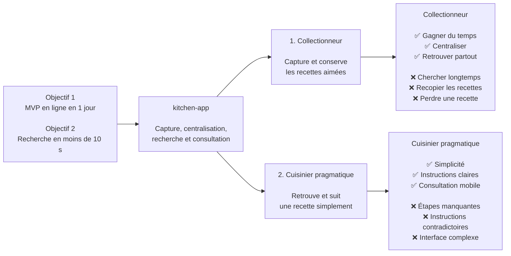

# Trigger Map Hub: kitchen-app

> La boussole stratégique du MVP de centralisation des recettes

**Créé :** 2026-08-04  
**Auteur :** Thomas  
**Méthodologie :** Effect Mapping, adapté au Whiteport Design Studio

---

## Vue d'ensemble

### Vision

`kitchen-app` est une application rapide à mettre en place, qui permet au foyer d'enregistrer une recette aimée depuis une photo ou une URL, puis de la retrouver facilement au moment voulu.

### Cible principale

**Le Collectionneur de recettes** veut passer rapidement d'une recette dispersée dans un livre ou en ligne à une recette centralisée et retrouvable partout.

### Transformation clé

De recettes dispersées et difficiles à retrouver vers une base familiale accessible, recherchable et consultable au moment de cuisiner.

### La boucle de feedback

1. Mettre rapidement une première version en ligne.
2. Capturer une recette réelle.
3. La rechercher et la consulter dans le foyer.
4. Observer les difficultés et recueillir le feedback.
5. Améliorer le produit par itérations courtes.

---

## Trigger Map

---

## Objectifs métier

1. **Mise en ligne :** rendre le MVP accessible sur le VPS en 1 jour maximum.
2. **Recherche :** retrouver une recette en moins de 10 secondes.
3. **Alimentation :** permettre l'ajout d'au moins 1 recette par jour.
4. **Adoption :** faire utiliser l'application par 2 membres du foyer au lancement.

---

## Utilisateurs cibles

### 1. Le Collectionneur de recettes

Personne principale pour laquelle la capture et la centralisation sont prioritaires. Elle trouve des recettes dans des livres ou sur Internet et veut les conserver sans les recopier.

[Voir la persona détaillée](personas/collectionneur-de-recettes.md)

### 2. Le Cuisinier pragmatique

Personne secondaire qui consulte les recettes avant les courses, lors du choix d'un repas et pendant la préparation. Elle attend une lecture claire sur mobile.

[Voir la persona détaillée](personas/cuisinier-pragmatique.md)

---

## Priorités de conception

### Must Have MVP

- Recherche texte
- Centralisation des recettes
- Capture photo/scan ponctuelle
- Consultation responsive

### À considérer dans le MVP

- Import depuis une URL
- Ajout manuel

### À différer

- Partage de recettes
- Listes de courses
- Import de livres
- Fonctionnalités IA
- Données nutritionnelles et liens entre ingrédients
- Format texte structuré avancé

[Voir l'analyse d'impact complète](feature-impact-analysis.md)

---

## Focus stratégique

Construire d'abord le chemin le plus court entre une recette trouvée dans un livre ou en ligne et sa consultation fiable au moment de cuisiner. La livraison rapide prime afin de recueillir du feedback réel et d'améliorer le produit par itérations.

**Doit répondre à :**

- La centralisation simple
- La recherche en moins de 10 secondes
- La capture photo/scan ponctuelle
- La consultation mobile claire

**Devrait répondre à :**

- L'import URL simple
- L'ajout manuel minimal

---

## Comment lire ce document

Le diagramme se lit de gauche à droite :

1. Les objectifs métier donnent la direction.
2. `kitchen-app` fournit la transformation produit.
3. Les personas représentent les utilisateurs à servir.
4. Les motivations positives indiquent ce qu'ils veulent obtenir.
5. Les motivations négatives indiquent ce qu'ils veulent éviter.

Les priorités de conception se lisent du haut vers le bas dans les sections dédiées. Les symboles ✅ représentent les motivations et ❌ les freins.

---

## Documentation détaillée

| Document | Contenu |
|---|---|
| [Product Brief](../A-Product-Brief/project-brief.md) | Périmètre, challenge, objectifs et contraintes du MVP |
| [Trigger Map](trigger-map.md) | Vision, objectifs, groupes cibles et focus stratégique |
| [Collectionneur](personas/collectionneur-de-recettes.md) | Persona principale et motivations de capture |
| [Cuisinier pragmatique](personas/cuisinier-pragmatique.md) | Persona secondaire et besoins de consultation |
| [Analyse d'impact](feature-impact-analysis.md) | Scores, décisions MVP et implications UX |

---

## Prochaines étapes

- [ ] Concevoir le parcours capture → recherche → consultation.
- [ ] Valider l'expérience avec les deux membres du foyer.
- [ ] Mettre le MVP en ligne sur le VPS.
- [ ] Recueillir le premier feedback réel.
- [ ] Réévaluer les priorités après usage.

---

_Généré avec le framework Whiteport Design Studio_  
_Crédits méthodologiques : Effect Mapping par Mijo Balic et Ingrid Domingues, adapté par WDS_
